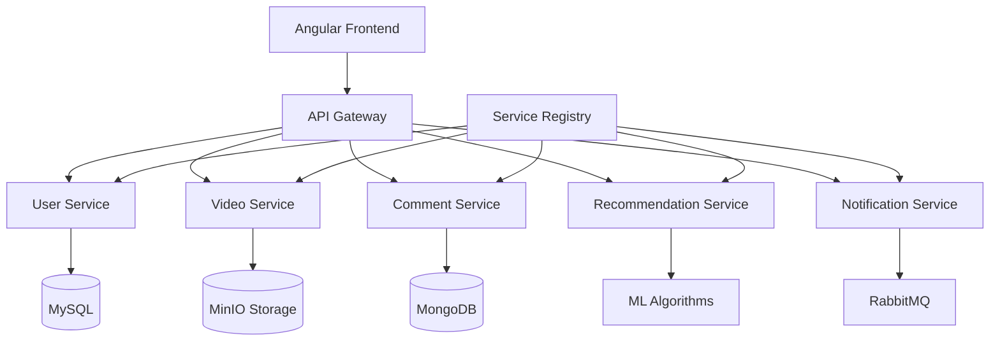

# 🎬 ZAHY FILMS - Video Streaming Platform


[](https://opensource.org/licenses/MIT)
[](https://www.oracle.com/java/)
[](https://angular.io/)
[](https://spring.io/projects/spring-boot)
[](https://www.docker.com/)

**ZAHY FILMS** is a modern, scalable video streaming platform built with microservices architecture. Developed as a final year project at ENSAJ (École Nationale des Sciences Appliquées d'El Jadida), it delivers a Netflix-like experience with personalized recommendations, social interactions, and robust content management.

---

## 📋 Table of Contents

- [🌟 Features](#-features)
- [🏗️ Architecture](#️-architecture)
- [🛠️ Tech Stack](#️-tech-stack)
- [📁 Project Structure](#-project-structure)
- [🚀 Quick Start](#-quick-start)
- [⚙️ Installation Guide](#️-installation-guide)
- [🧪 Testing](#-testing)
- [📊 Performance](#-performance)
- [🔮 Roadmap](#-roadmap)
- [🤝 Contributing](#-contributing)
- [👥 Team](#-team)
- [📄 License](#-license)

---

## 🌟 Features

### 🎯 User Experience
- **🔐 Account Management**: Secure registration, authentication, and profile customization
- **📺 Video Streaming**: High-quality streaming with adaptive bitrate
- **💎 Subscription Tiers**: Free and premium content access
- **❤️ Social Interactions**: Like, comment, reply, and favorite videos
- **🎯 Smart Recommendations**: AI-powered suggestions based on viewing patterns
- **📱 Responsive Design**: Seamless experience across all devices
- **🤖 CineBot Assistant**: Intelligent chatbot for movie queries
- **🔔 Real-time Notifications**: Stay updated with new content and interactions

### 🛡️ Admin Dashboard
- **📊 Analytics Dashboard**: Comprehensive platform statistics
- **🎬 Content Management**: Upload, edit, and organize video content
- **👥 User Management**: Monitor and manage user accounts
- **💳 Subscription Control**: Flexible subscription plan management
- **📈 Performance Monitoring**: Real-time system health metrics

---

## 🏗️ Architecture

ZAHY FILMS follows a **microservices architecture** with the **MVC pattern**, ensuring scalability, maintainability, and fault tolerance.



### 🔧 Microservices

| Service | Technology | Database | Purpose |
|---------|------------|----------|---------|
| **User Service** | Spring Boot + Security | MySQL | Authentication, profiles, subscriptions |
| **Video Service** | Spring Boot | MinIO | Video management, streaming |
| **Comment Service** | Spring Boot | MongoDB | Social interactions, comments |
| **Recommendation Service** | Flask + ML | - | AI-powered recommendations |
| **Notification Service** | Spring Boot | RabbitMQ | Async notifications |

### 🌐 Infrastructure Components
- **API Gateway**: Request routing and load balancing
- **Service Registry**: Dynamic service discovery (Eureka)
- **Message Broker**: Asynchronous communication (RabbitMQ)
- **Object Storage**: Scalable video storage (MinIO)
- **Chatbot**: Customer support automation (Botpress)
- **Payment Gateway**: Secure transactions (PayPal)

---

## 🛠️ Tech Stack

### **Frontend**
-  **Angular 15+** - Modern web framework
-  **TypeScript** - Type-safe JavaScript
-  **HTML5** &  **CSS3** - Modern web standards

### **Backend**
-  **Java 17** - Enterprise-grade language
-  **Spring Boot 3.0+** - Microservices framework
-  **Spring Security** - Authentication & authorization
-  **Python + Flask** - ML recommendation engine

### **Databases & Storage**
-  **MySQL** - Relational data
-  **MongoDB** - Document storage
-  **MinIO** - Object storage

### **DevOps & Tools**
-  **Docker** - Containerization
-  **RabbitMQ** - Message queuing
-  **SonarQube** - Code quality
-  **PayPal API** - Payment processing

---

## 📁 Project Structure

```
zahy-films/
├── 📁 backend/
│   ├── 📁 ServiceAuth/            # User management & auth
│   ├── 📁 service-video/          # Video streaming & storage
│   ├── 📁 service-commentaire/    # Social interactions
│   ├── 📁 service-notification/   # Async notifications
│   ├── 📁 apigateway/             # Request routing
│   ├── 📁 sebtiment-service-flask/          
│   └── 📁 eureka/               # Service discovery
├── 📁 frontend/                 # Angular application
│   ├── 📁 src/           
│        ├── 📁 app/          
│        ├── 📁 assets/   
│        ├── 📁 environements/   

```

---

## 🚀 Quick Start

### Using Docker (Recommended)

```bash
# Clone the repository
git clone https://github.com/Younessamg/PFA_II_ZAHY_Films.git
cd zahy-films

# Start all services with Docker Compose
docker-compose up -d

# Wait for services to be ready (2-3 minutes)
# Access the application at http://localhost:4200
```

### Manual Setup

```bash
# Prerequisites check
java --version    # Should be 17+
node --version    # Should be 16+
python --version  # Should be 3.8+

# Clone and setup
git clone git https://github.com/Younessamg/PFA_II_ZAHY_Films.git
cd zahy-films

# Quick start script
chmod +x scripts/quick-start.sh
./scripts/quick-start.sh
```

---

## ⚙️ Installation Guide

<details>
<summary>📋 Prerequisites</summary>

- **Java JDK 17+**
- **Node.js 16+** and npm
- **Python 3.8+** and pip
- **Docker & Docker Compose** (recommended)
- **MySQL 8.0+**
- **MongoDB 5.0+**
- **RabbitMQ 3.8+**

</details>

<details>
<summary>🔧 Environment Setup</summary>

### 1. Clone Repository
```bash
git clone https://github.com/Younessamg/PFA_II_ZAHY_Films.git
cd zahy-films
```

### 2. Environment Variables
```bash
# Copy environment templates
cp .env.example .env
cp backend/.env.example backend/.env

# Edit configuration files with your settings
```

### 3. Database Setup
```bash
# MySQL
mysql -u root -p < scripts/mysql-schema.sql

# MongoDB
mongosh < scripts/mongodb-setup.js
```

</details>

<details>
<summary>🏃‍♂️ Service Startup</summary>

### Backend Services
```bash
# Start Eureka Server (Service Registry)
cd backend/eureka-server
./mvnw spring-boot:run

# Start API Gateway
cd ../api-gateway
./mvnw spring-boot:run

# Start microservices
cd ../user-service && ./mvnw spring-boot:run &
cd ../video-service && ./mvnw spring-boot:run &
cd ../comment-service && ./mvnw spring-boot:run &
cd ../notification-service && ./mvnw spring-boot:run &
```

### Frontend & ML Service
```bash
# Angular Frontend
cd frontend
npm install && ng serve

# Python Recommendation Service
cd recommendation-service
pip install -r requirements.txt
python app.py
```

</details>

---

## 🧪 Testing

We follow the **Test Pyramid** approach for comprehensive coverage:

```bash
# Backend Tests
cd backend
./mvnw test                    # Unit tests
./mvnw verify                  # Integration tests

# Frontend Tests
cd frontend
ng test                        # Unit tests
ng e2e                         # End-to-end tests

# ML Service Tests
cd recommendation-service
pytest tests/                  # Python tests

# Code Quality Analysis
sonar-scanner                  # SonarQube analysis
```

### 📊 Test Coverage Goals
- **Unit Tests**: >80% coverage
- **Integration Tests**: Critical paths covered
- **E2E Tests**: User journey validation

---

## 📊 Performance

### 🎯 Performance Metrics
- **Response Time**: <200ms for API calls
- **Video Loading**: <3s for HD content
- **Concurrent Users**: Supports 1000+ simultaneous streams
- **Uptime**: 99.9% availability target

### 🔧 Optimization Features
- **CDN Integration**: Fast global content delivery
- **Caching Strategy**: Redis for frequent queries
- **Load Balancing**: Automatic traffic distribution
- **Database Indexing**: Optimized query performance

---

## 🔮 Roadmap

### 🎯 Phase 1 (Current)
- [x] Core streaming functionality
- [x] User management & subscriptions
- [x] Basic recommendations
- [x] Social features (comments, likes)

### 🚀 Phase 2 (Next Quarter)
- [ ] **Live Streaming**: Real-time broadcast capabilities
- [ ] **Mobile Apps**: iOS and Android applications
- [ ] **Advanced ML**: Deep learning recommendations
- [ ] **Content Creator Tools**: Upload and monetization features

### 🌟 Phase 3 (Future)
- [ ] **Multi-language Support**: Internationalization
- [ ] **Offline Viewing**: Download for offline access
- [ ] **VR Integration**: Virtual reality content support
- [ ] **Blockchain**: NFT-based content ownership

---

## 🤝 Contributing

We welcome contributions! Please see our [Contributing Guide](CONTRIBUTING.md) for details.

### 🔄 Development Workflow
1. **Fork** the repository
2. **Create** a feature branch (`git checkout -b feature/amazing-feature`)
3. **Commit** your changes (`git commit -m 'Add amazing feature'`)
4. **Push** to the branch (`git push origin feature/amazing-feature`)
5. **Open** a Pull Request

### 📝 Code Standards
- Follow **Google Java Style Guide**
- Use **Angular Style Guide** for frontend
- Write **comprehensive tests**
- Document your code

---


### 🎓 Academic Supervision
- **Supervisor**: Prof. Chafik BAIDADA
- **Evaluator**: Prof. Hajar LAZAR
- **Institution**: ENSAJ, Université Chouaib Doukkali
- **Academic Year**: 2024/2025

---
👥 Team
This project was developed by talented students from ENSAJ (École Nationale des Sciences Appliquées d'El Jadida):
AMERGA Younes
TAGHTI Zineb 
LALHOU Asmae
SABROU Hafsa

---
## 🙏 Acknowledgments

Special thanks to:
- **Prof. Chafik BAIDADA** for expert guidance and mentorship
- **Prof. Hajar LAZAR** for thorough project evaluation
- **ENSAJ Faculty** for providing excellent education and resources
- **Open Source Community** for the amazing tools and libraries

---

## 📄 License

This project is licensed under the **MIT License** - see the [LICENSE](LICENSE) file for details.

---

<div align="center">

**⭐ Star this repository if you found it helpful!**

Made with ❤️ by the ZAHY FILMS Team at ENSAJ
</div>
